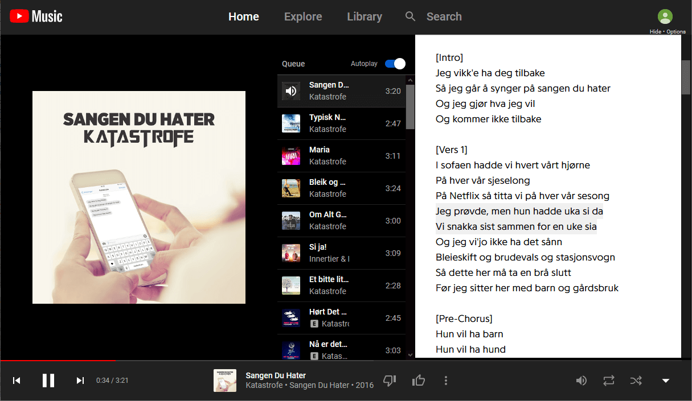

# Youtube-Music-Genius-Lyrics-userscript
A userscript or greasemonkey script that shows lyrics from [genius.com](https://genius.com/) on [YouTube Music](https://music.youtube.com/)

This is a userscript. It's primarily designed for Firefox and Chrome with
[Greasemonkey](https://addons.mozilla.org/firefox/addon/greasemonkey/) 
,
[Tampermonkey](https://www.tampermonkey.net/)  
or
[FireMonkey](https://addons.mozilla.org/en-US/firefox/addon/firemonkey/) .
General information about userscripts and how to use them can be found at [openuserjs.org/about/Userscript-Beginners-HOWTO](https://openuserjs.org/about/Userscript-Beginners-HOWTO).

If you already have a userscript extension installed, you can install with the link below:

[**Click here to install**](https://openuserjs.org/install/cuzi/Youtube_Genius_Lyrics.user.js)  
Tested with Firefox/**Greasemonkey** and Chrome/**Tampermonkey**.

Screenshot:

