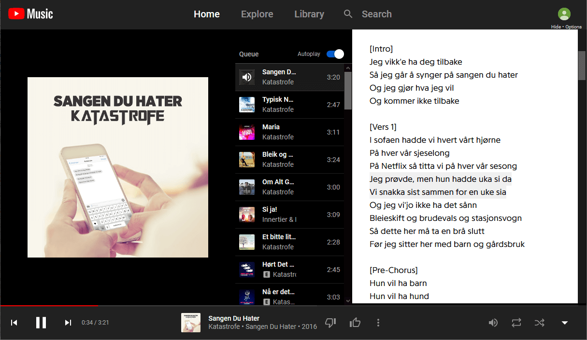
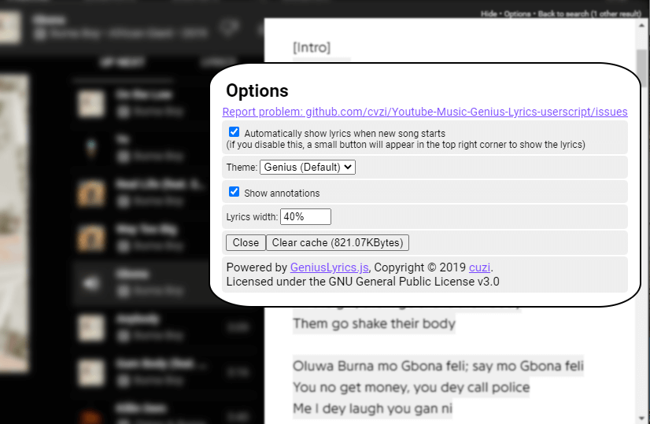
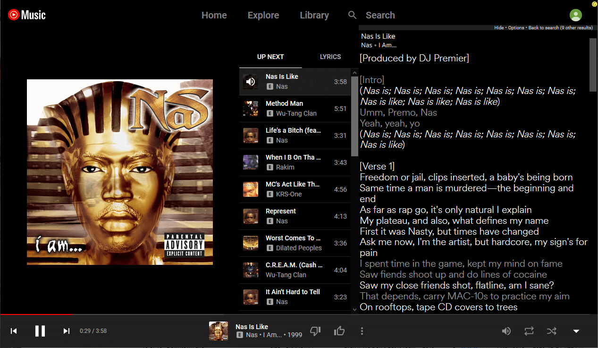
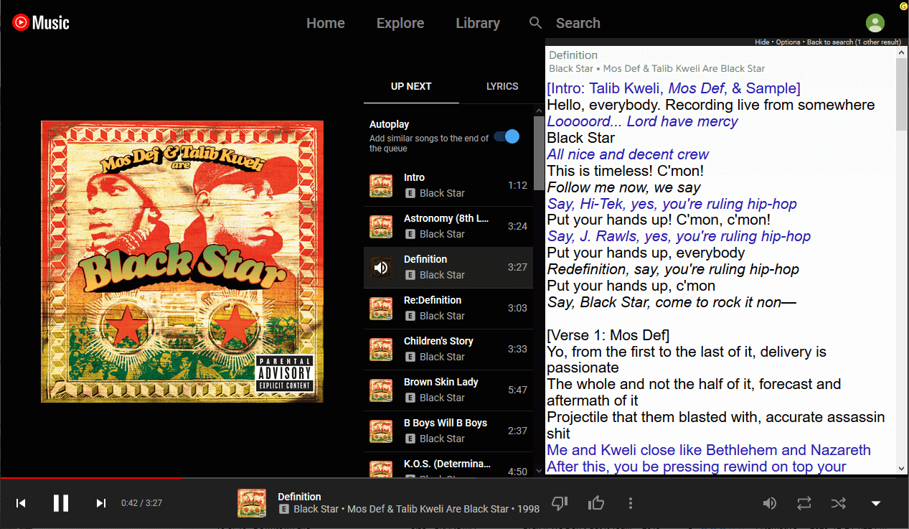

# Youtube-Music-Genius-Lyrics-userscript
A userscript or greasemonkey script that shows lyrics from [genius.com](https://genius.com/) on [YouTube Music](https://music.youtube.com/)

This is a userscript for your browser. It's primarily designed for Firefox and Chrome with
[Tampermonkey](https://www.tampermonkey.net/)  .

General information about userscripts and how to use them can be found at [openuserjs.org/about/Userscript-Beginners-HOWTO](https://openuserjs.org/about/Userscript-Beginners-HOWTO).

If you already have a userscript extension installed, you can install with the link below:

[**Click here to install**](https://greasyfork.org/scripts/406892-youtube-music-genius-lyrics/code/Youtube%20Music%20Genius%20Lyrics.user.js)  
Tested with Firefox/**Tampermonkey** and Chrome/**Tampermonkey**.

Family of GeniusLyrics Userscripts:
*   Powered by **GeniusLyrics Library** [GitHub](https://github.com/cvzi/genius-lyrics-userscript/) [Greaskfork](https://greasyfork.org/en/scripts/406698-geniuslyrics)
*   **Spotify Genius Lyrics** [GitHub](https://github.com/cvzi/Spotify-Genius-Lyrics-userscript) [Greaskfork](https://greasyfork.org/en/scripts/377439-spotify-genius-lyrics)
*   **Youtube Genius Lyrics** [GitHub](https://github.com/cvzi/Youtube-Genius-Lyrics-userscript) [Greaskfork](https://greasyfork.org/en/scripts/386259-youtube-genius-lyrics)
*   **Youtube Music Genius Lyrics** [GitHub](https://github.com/cvzi/Youtube-Music-Genius-Lyrics-userscript/) [Greaskfork](https://greasyfork.org/en/scripts/406892-youtube-music-genius-lyrics)

Screenshot:  

Options:  

Dark theme ("Spotify" theme):  

White theme:  

 
